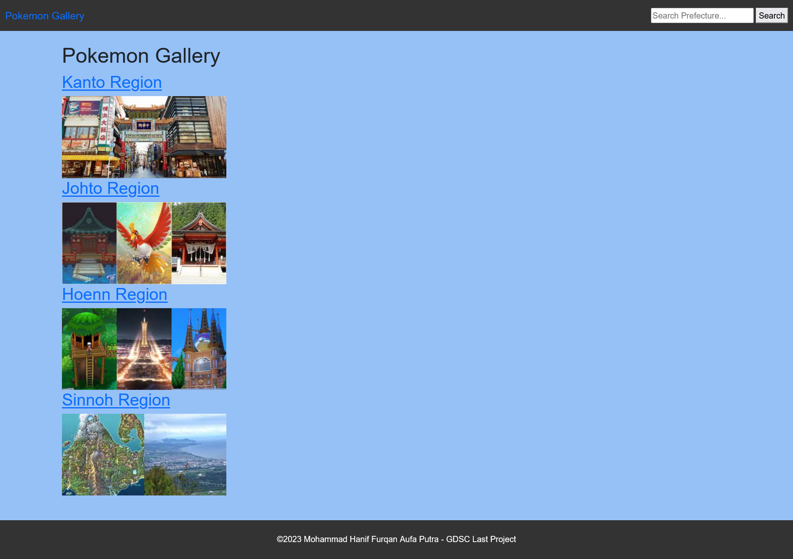
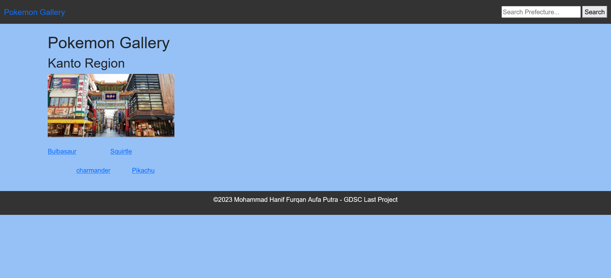
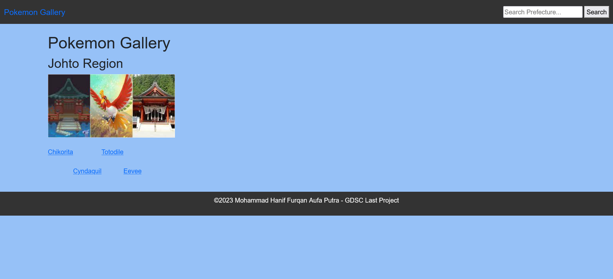
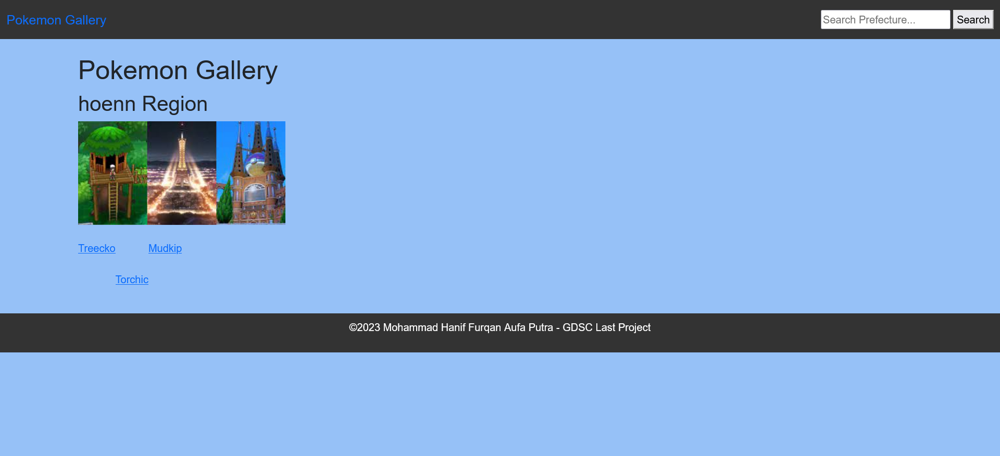
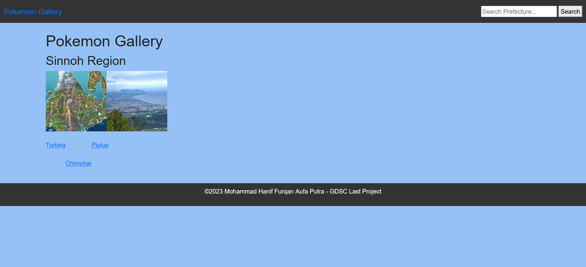
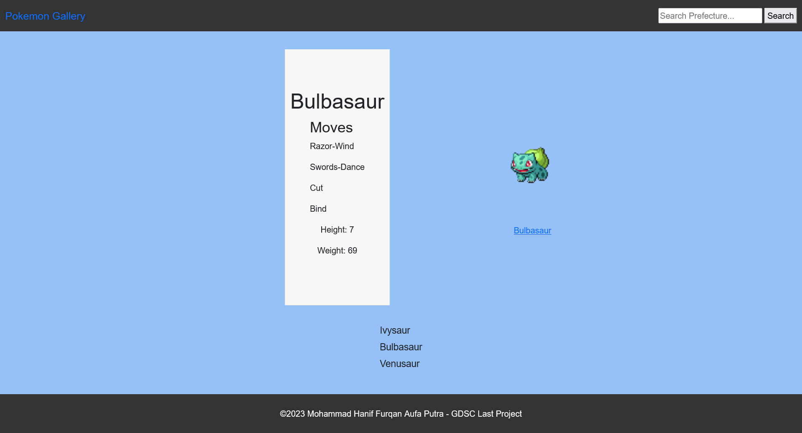
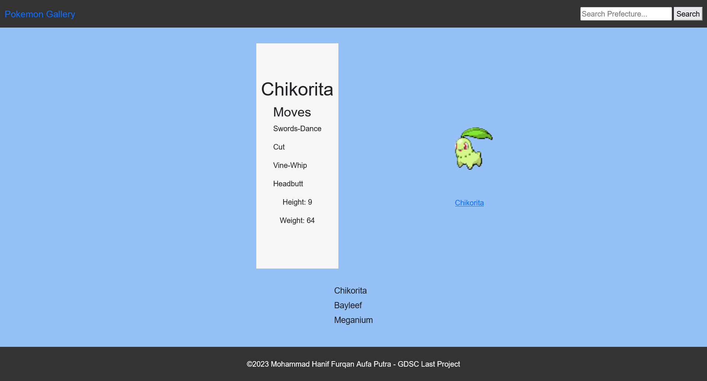
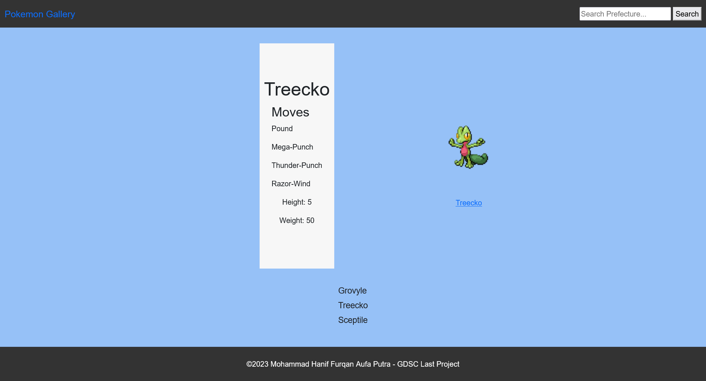

# GDSC_ITB_2022-Last_Project-Web_Dev
This is will be my last project of GDSC ITB 2022 my main path is web development

Implementation HTML, CSS, JavaScript, and API

In this case I like to make a Pokemon Gallery of Starter of 4 Regions

Progress: 100%(Except the search feature only working in the local launch)
I discarded the pokemon search feature, but still implemented the search feature, I discarded the pokemon search system due to lack of experience in using the API.

 

 

 

 

 

 

 

 

 

And that's all, thx for read and see this alpha web